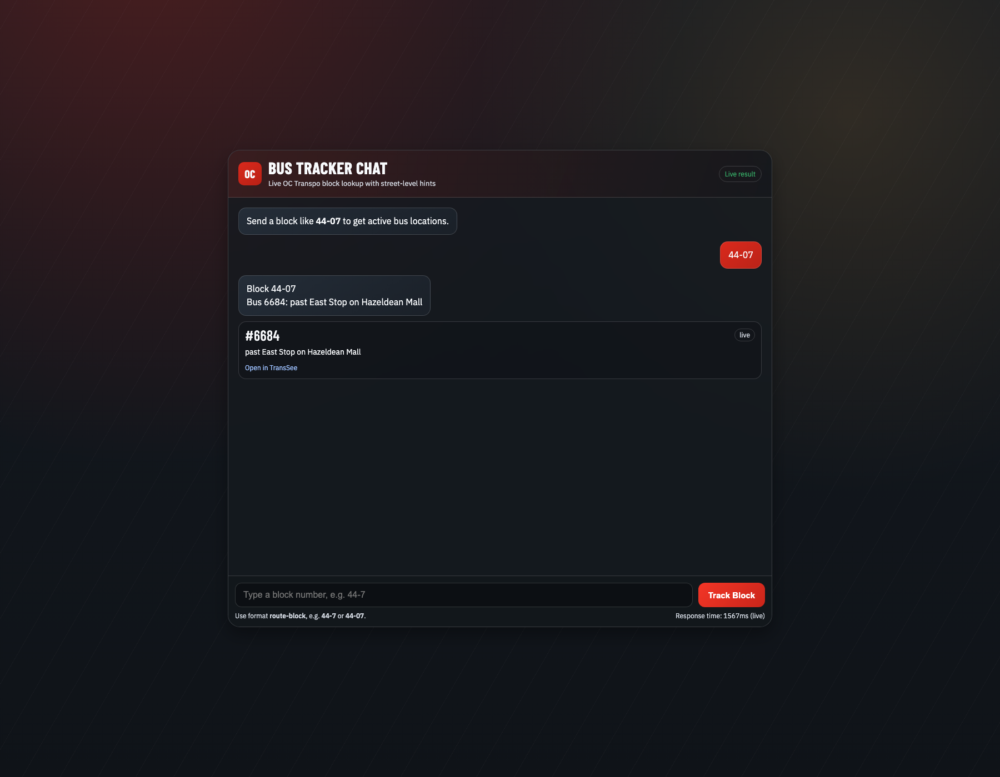
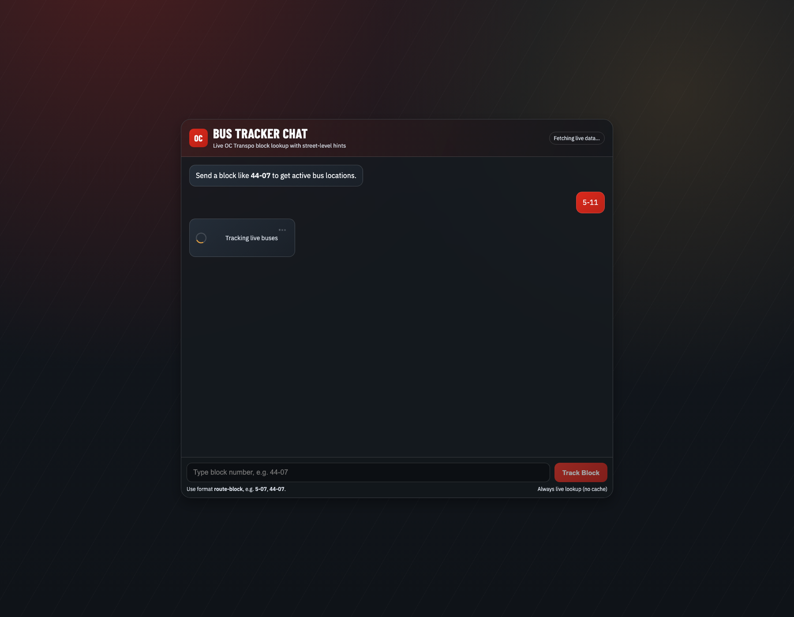

# OC Bus Tracker Chat

I built this project as a live OC Transpo helper tool. It takes a **block number** (example: `44-07`) and returns the active **bus number(s)** and latest **location text** in a chat-style interface.

## Live App

- Hugging Face Space: https://huggingface.co/spaces/OmarLKhattab/OC_Bus_Tracker

## Usage

1. Enter a block number in the standard format.
2. Submit with **Track Block**.
3. Read the returned bus number(s) and location line.

## Block Format

- `44-07` works
- `44-7` does **not** work

Leading zeroes are required where applicable, matching the operational block format.

## Testing Status

This project is still under testing. It should be used as a **helping tool**, not as a fully authoritative operational source.

## Local Run

```bash
npm install
npm start
```

Local URL:

`http://localhost:7860`

## API Example

```bash
curl -s -X POST http://127.0.0.1:7860/api/chat \
  -H "content-type: application/json" \
  --data '{"message":"44-07"}'
```

## Example Screens

These screenshots show the expected behavior:

1. Correct input (`44-07`) returns bus/location.
2. Incorrect input (`44-7`) returns a format-related error.
3. No-bus-assigned case returns a no-bus-found message.

### 1) Correct Input (`44-07`)


### 2) Incorrect Input (`44-7`)


### 3) No Bus Assigned Yet

